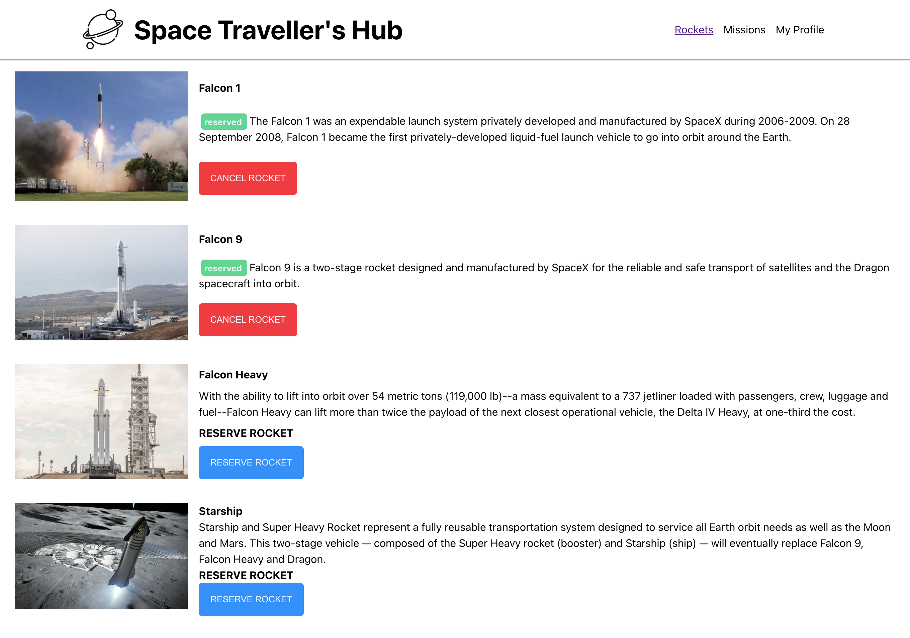
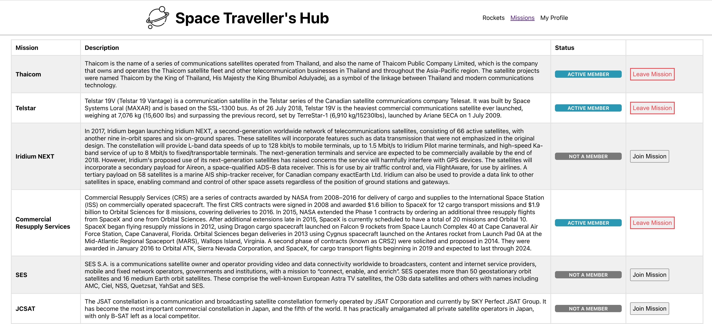

# The SPACE TRAVELLERS App.

> Working with the real live data from the SpaceX API. A web application for a company that provides commercial and scientific space travel services. The application will allow users to book rockets and join selected space missions.

# ROCKETS

# MISSIONS

## Built Wit

- HTML, SCSS and Js (ES6).
- Using React Framework
- Webpack
- Git, Github and VsCode.
- Redux for state management

### Live Demo

- Not yet available.

## Getting Started

To get a local copy up and running follow these simple example steps.

### Prerequisites

- A modern upto-date browser
- Text Editor or IDE

### Setup

1.  Clone the Repo or Download the Zip file or `https://github.com/billionsjoel//space-travellers.git`.
2.  `cd/space-travellers`

### Install

After cloning the project you need to run these commands

- `npm install` `This command will download all the dependancies of the project`
- `npm run start`

## Authors

👤 ** Atugonza Billions joel **

- GitHub: [@billionsjoel](https://github.com/billionsjoel)
- Twitter: [@billionsjoel](https://twitter.com/BillionsJoel)
- LinkedIn: [billionsjoel](https://www.linkedin.com/in/billionsjoel/)

👤 ** Angel Orozco  **

- GitHub: [@orozCoding](https://github.com/orozCoding)
- Twitter: [@orozCoding](https://twitter.com/orozCoding)
- LinkedIn: [orozCoding](https://www.linkedin.com/in/angel-orozco-652230228/)

## 🤝 Contributing

Contributions, issues, and feature requests are welcome!

Feel free to check the [issues page](https://github.com/billionsjoel//space-travellers/issues).

## Show your support

Give a ⭐️ if you like this project!

## Acknowledgments

- Hat tip to anyone whose code was used
- Inspiration
- etc

## 📝 License

This project is [MIT](./MIT.md) licensed.
